# SHOGUN User Manual

**Drum machine with patch bay · Jidai Collection · Martial Systems**

---

## Contents

1. Overview
2. Quick start
3. Panel reference
4. Patching
5. MIDI and host sync
6. Factory presets by bank
7. DAW setup
8. Specs
9. Troubleshooting
10. Legal

Appendix: Back panel patching (SHOGUN in the JIDAI RACK)

---

## 1. Overview

SHOGUN is an analog-style drum machine with sixteen voices, a step sequencer for every voice and a patch bay. It has fourteen drum voices and two synth voices:

| Voice | Sound |
|---|---|
| BD1, BD2 | Two kicks. BD1 is a tuned resonator with pitch sweep, attack click, noise, filter and drive. BD2 is an oscillator kick with a tone control. |
| SD, RS | Snare (two tuned tones plus snappy noise) and rim shot. |
| CP, CL | Hand clap (1 to 8 bursts) and claves. |
| MA, CB | Maracas and cowbell. |
| CH, OH, CY | Closed hat, open hat and cymbal. The closed hat always chokes the open hat. |
| LTC, MTC, HTC | Low, mid and high toms. Each switches to a conga. |
| LEAD, BASS | Two mono synths with saw or square waves, resonant filter, envelope, glide and accent. LEAD has a state-variable filter, BASS a 4-pole ladder filter. |

Around the voices:

- **A sequencer with a track per voice.** Each track has its own length (1 to 32 steps), step scale, swing and timing shift, so tracks can run in polymeter. Steps carry accent (3 levels), flam, ratchet, probability, micro-timing, pitch bend and, on the synth tracks, a note and a tie. Patterns can also lock any parameter on a step.
- **A triple wave shaper** on BD1, BD2 and the three toms: three folding stages in series under one WAVE knob, with SHAPE, symmetry and audio-rate modulation.
- **Four LFOs and a 32-slot mod matrix**, with sources such as each voice's envelope, velocity, accent and per-hit random, plus the mod wheel and aftertouch.
- **A mixer** with pan, mute, solo and a delay send per voice, four buses with drive, tone and compressor, eight stereo aux outputs and a master section with drive, glue, width and a clipper.
- **A patch bay** of 151 jacks that follows the Jidai Cable Standard, so SHOGUN cables straight into BUSHIDO, RONIN and ORIGAMI in the JIDAI RACK.
- **Analog behaviour**: slow pitch drift while playing, and fixed per-voice tolerances that belong to the unit and are saved with the patch.

SHOGUN runs as a VST3 instrument and as a device in the JIDAI RACK. A new instance starts on the INIT kit with an empty pattern. The factory bank adds 21 kits, each with its own pattern.

## 2. Quick start

1. Insert SHOGUN on an instrument track in your DAW (section 7).
2. Click the **⌕** key next to KIT and pick a kit, for example **002 Deep Round Kick House**. The kit and its pattern load together.
3. Choose a clock with the **SRC** key in the header:
   - **HOST** plays while your DAW plays, locked to the song position. Press play in the DAW.
   - **INT** runs on SHOGUN's own TEMPO. Click **▶** to start and stop.
4. Turn the voice knobs on the **MAIN** tab. Click a voice name (BD1, SD and so on) to select it and hear it.
5. Edit the selected voice's steps in the STEPS row: click a step to turn it on or off, shift-click for an accent.
6. Open **GRID** to see and edit all sixteen tracks at once.
7. Play SHOGUN from a MIDI keyboard: drums on notes 36 to 49, LEAD on channel 1, BASS on channel 2 (section 5).

Loading a kit resets the clock source to INT. If you work with SRC on HOST, click SRC again after loading.

## 3. Panel reference

The panel is 1200 × 672 points with eight tabs: MAIN, VOICE, GRID, MOD, ROUTE, FX/MIX, SEQ/MIDI and GLOBAL. The header and the CLOCK, SYNC and MASTER strip stay in view on every tab.

### 3.1 Using the controls

| Action | Result |
|---|---|
| Drag a knob up or down | Changes its value. Hold **Shift** for fine control (4× finer). |
| Mouse wheel over a knob | Small steps. |
| Double-click a knob | Returns it to its default (the INIT kit value). |
| Click a key or display | Steps to the next choice. Toggles flip. |
| Right-click a key or display | Steps back one choice. |
| Click a tab | Shows that tab. |

Every sound, mixer, clock and global control is a plugin parameter (454 in all), so your DAW can automate it. Knob moves, step edits, cable changes and kit loads can all be undone.

### 3.2 Header

| Control | What it does |
|---|---|
| Tabs | MAIN, VOICE, GRID, MOD, ROUTE, FX/MIX, SEQ/MIDI, GLOBAL. |
| **KIT** display | The loaded program's name. Click it for the program list. |
| KIT **◀ ▶** | Steps to the previous or next program: INIT, then the 21 factory kits. The list wraps around. |
| **PATTERN** display | The loaded pattern's name. Click it for the program list. |
| PATTERN **◀ ▶** | The same program steps as the KIT arrows. Every program is a kit with its matching pattern. |
| **⌕** | Opens the program list. |
| **A** / **B** | Compare two versions of the whole patch. Click a slot to switch to it (the first visit to B starts as a copy of A). Right-click or shift-click a slot to copy the other slot onto it. |
| **↶** / **↷** | Undo and redo, 64 levels. |

### 3.3 CLOCK, SYNC and MASTER strip

| Control | Range | What it does |
|---|---|---|
| **▶** | | Starts and stops the sequencer when SRC is INT or EXT. |
| **RST** | | Restarts the pattern from step 1. |
| **INT / EXT** switch | INT, EXT | Where the voices are played from. **INT**: the pattern plays the voices. **EXT**: only the TRIG and GATE jacks play them (section 4). |
| **TEMPO** | 40 to 200 BPM, default 120 | SHOGUN's own tempo. With SRC on HOST, the host tempo is used. |
| **SWING** | 50 to 75 %, default 50 % | Delays every second step. 50 % is straight. |
| **SCALE** | 1/32, 1/16, 1/8T, 1/8 | Step length for tracks set to GLOBAL. Default 1/16. |
| **BAR** | 1 to 32 steps, default 16 | Bar length in steps. Sets the STEP/BAR count, the RST OUT pulse and LFO bar restarts. |
| **STEP / BAR** | | Bar and step position, with a run light. |
| **CLK IN** display | STEP, 1, 2, 4, 24, 48 PPQN | How SHOGUN reads pulses at CLK IN when SRC is EXT: one pulse per step, or 1 to 48 pulses per quarter note. |
| **SRC** | HOST, INT, EXT | The clock source (section 5). Click for the next, right-click for the previous. |
| **ACCENT** | 0 to 100 %, default 100 % | How much velocity and accent change the level. At 0 every hit plays at full level. |
| **DRIVE** | OFF to +24 dB | Master drive. |
| **VOLUME** | -inf to +6 dB, default 0 dB | Master volume. |
| Meter, **CLIP**, **CPU** | | Output level (-48 to 0 dBFS), a clip light (click it to clear) and the processing load. |

### 3.4 MAIN tab

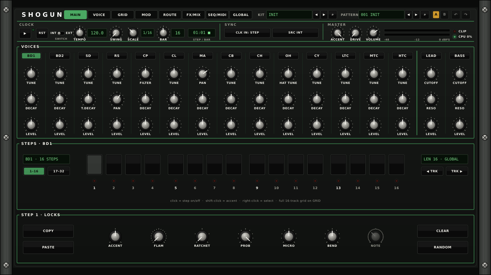

**VOICES.** Three knobs per voice, with the voice's name key on top. Click a name key to select the voice and audition it. The knobs are each voice's most used controls:

| Voice | Knobs |
|---|---|
| BD1, BD2, SD, CL, CB, CH, CY, LTC, MTC, HTC | TUNE, DECAY, LEVEL (SD: TUNE, T.DECAY, LEVEL) |
| RS | TUNE, PAN, LEVEL |
| CP | FILTER, DECAY, LEVEL |
| MA | PAN, DECAY, LEVEL |
| OH | HAT TUNE (shared with CH), DECAY, LEVEL |
| LEAD, BASS | CUTOFF, RESO, LEVEL |

**STEPS.** The selected voice's track, 16 steps at a time.

| Control | What it does |
|---|---|
| Step keys | Click: step on or off. Shift-click: step on and toggle its accent. Right-click: select the step without changing it. |
| Track display | The selected track and its length. |
| **1-16** / **17-32** | Shows the first or second half of a 32-step track. |
| **LEN** display | The track's length and scale (GLOBAL or its own). |
| **◀ TRK** / **TRK ▶** | Selects the previous or next track. |

**STEP · LOCKS.** The selected step's settings:

| Control | Range | What it does |
|---|---|---|
| **ACCENT** | 3 levels | Soft, normal or accented. |
| **FLAM** | OFF, 1 to 16 | Plays the hit 2 to 5 times in quick succession, with gaps from 3.75 to 15 ms. Not used on CP. |
| **RATCHET** | 1, 2, 3, 4, 6, 8 | Splits the step into that many even hits. |
| **PROB** | 0 to 100 % | Chance that the step plays. The pattern's random seed fixes each result, so the song plays the same way every time from the same point. |
| **MICRO** | ± half a step | Moves the hit early or late. |
| **BEND** | -12 to +12 semitones | Pitch bend for the hit. |
| **NOTE** | C1 to C7 | The note for a LEAD or BASS step. |
| **COPY / PASTE** | | Copies the selected track's steps and length, and pastes them onto another track. |
| **CLEAR** | | Clears the selected track. |
| **RANDOM** | | Turns on a random 30 % of the track's steps. |

### 3.5 VOICE tab

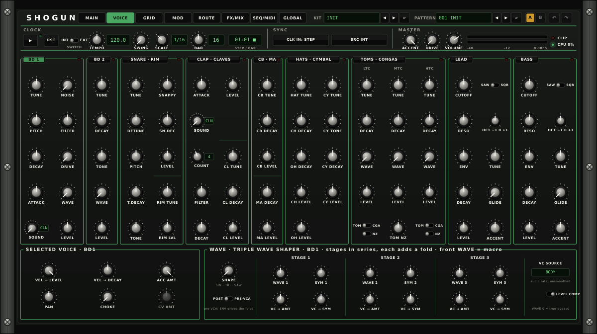

Every sound control of every voice, in voice groups:

| Group | Controls and ranges |
|---|---|
| **BD 1** | TUNE 35 to 140 Hz · PITCH (sweep depth) 0 to +18 semitones · DECAY 8 to 720 ms · ATTACK (click) · SOUND (attack colour, CLN and 1 to 15) · NOISE · FILTER 200 Hz to 8 kHz · DRIVE OFF to 9 · WAVE · LEVEL |
| **BD 2** | TUNE 45 to 100 Hz · DECAY · TONE · WAVE · LEVEL |
| **SNARE · RIM** | TUNE 120 to 400 Hz · DETUNE ±8 semitones (second tone) · PITCH (sweep) 0 to +14 semitones · T.DECAY (tone decay) · TONE · SNAPPY · SN.DEC (snappy decay) · LEVEL · RIM TUNE 250 Hz to 2.5 kHz · RIM LVL |
| **CLAP · CLAVES** | ATTACK · SOUND (burst colour, CLN and 1 to 15) · COUNT 1 to 8 bursts · FILTER 400 Hz to 6 kHz · DECAY · LEVEL · CL TUNE 400 Hz to 3 kHz · CL DECAY · CL LEVEL |
| **CB · MA** | CB TUNE 300 Hz to 1.2 kHz · CB DECAY · CB LEVEL · MA DECAY · MA LEVEL |
| **HATS · CYMBAL** | HAT TUNE ×0.5 to ×2 · CH DECAY · OH DECAY · CH LEVEL · OH LEVEL · CY TUNE ×0.5 to ×2 · CY TONE · CY DECAY · CY LEVEL |
| **TOMS · CONGAS** | Per tom: TUNE (LTC 70 to 180 Hz, MTC 100 to 280 Hz, HTC 140 to 400 Hz) · DECAY · WAVE · LEVEL · TOM/CGA switch · NZ (noise on) · and the shared TOM NZ level |
| **LEAD**, **BASS** | CUTOFF (LEAD 200 Hz to 8 kHz, BASS 80 Hz to 4 kHz) · RESO · ENV (filter envelope depth) · DECAY · SAW/SQR · OCT -1, 0, +1 · TUNE ±100 cents · GLIDE 2 to 489 ms · ACCENT · LEVEL |

Every DECAY runs from 8 to 720 ms. Click a group's name to select its voice.

**SELECTED VOICE.** Settings for the selected voice:

| Control | Range | What it does |
|---|---|---|
| **VEL → LEVEL** | 0 to 100 %, default 100 % | How much velocity and accent change the voice's level. |
| **VEL → DECAY** | -100 to +100 % | Velocity lengthens or shortens the decay. |
| **ACC AMT** | 0 to 100 %, default 100 % | Accent depth for the voice. |
| **PAN** | -100 to +100 % | Equal-power pan. |
| **CHOKE** | OFF, 1 to 4 | Voices in the same group cut each other off. |
| **CV AMT** | -100 to +100 %, default +100 % | Scales the voice's PITCH, DECAY and TONE jacks (drum voices). |

**WAVE · TRIPLE WAVE SHAPER.** For the selected kick or tom (BD1, BD2, LTC, MTC, HTC). Three folding stages run in series. The front WAVE knob (on the voice) is a macro that brings in stage 1, then 2, then 3.

| Control | Range | What it does |
|---|---|---|
| **SHAPE** | SIN, TRI, SAW | Morphs the voice's body from sine through triangle to saw before the shaper. |
| **POST / PRE-VCA** | | POST shapes the finished voice. PRE-VCA shapes it before the envelope, so the envelope drives the folds. |
| **WAVE 1, 2, 3** | -100 to +100 % | Per-stage trims on top of the macro. |
| **SYM 1, 2, 3** | -100 to +100 % | Tilts each stage's fold for even harmonics. |
| **VC → AMT**, **VC → SYM** | -100 to +100 % | How much the VC source moves each stage's amount and symmetry. |
| **VC SOURCE** | BODY, NOISE, LFO 1 to 4, any voice | The internal modulation source, at audio rate. A cable into the voice's FOLD VC jack replaces it. |
| **LEVEL COMP** | OFF, ON | Keeps the level steady while you turn WAVE up. |

With WAVE and the WAVE 1 to 3 trims at 0, the shaper is bypassed, whatever the SYM settings: the sound passes through untouched. A stage whose amount is 0 is a straight wire at any SYM, so SYM only colours a stage that WAVE or its trim has opened. VC → AMT with a live VC source and SHAPE above 0 take the shaper out of bypass.

### 3.6 GRID tab

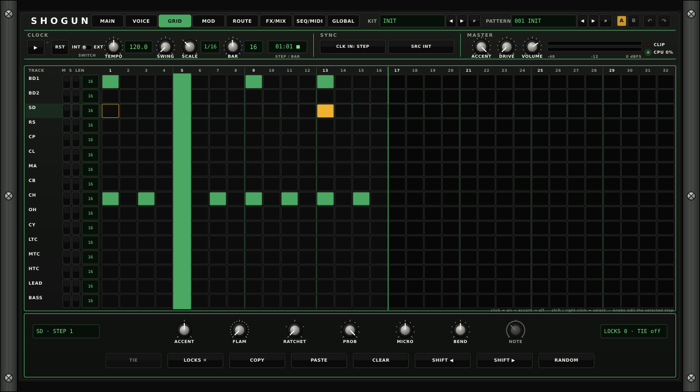

All sixteen tracks, 32 steps wide.

| Control | What it does |
|---|---|
| Grid cell | Click: off → on → accent → off. Shift-click or right-click: select the step and its track. |
| **M / S** | Mute and solo for the track. |
| **LEN** | The track's length. Click the right half to add a step, the left half to remove one (1 to 32). |
| Step knobs | ACCENT, FLAM, RATCHET, PROB, MICRO, BEND and NOTE for the selected step, as on MAIN. |
| **TIE** | On a LEAD or BASS step, holds the previous note into this step (legato with glide). |
| **LOCKS ✕** | Clears the selected step's parameter locks. The display shows how many locks the step has and whether it is tied. |
| **COPY / PASTE / CLEAR** | As on MAIN, for the selected track. |
| **SHIFT ◀ / SHIFT ▶** | Rotates the selected track one step left or right. |
| **RANDOM** | Turns on a random 30 % of the selected track's steps. |

Parameter locks come with the factory patterns and with saved patches. A locked step plays its own value for that parameter.

### 3.7 MOD tab

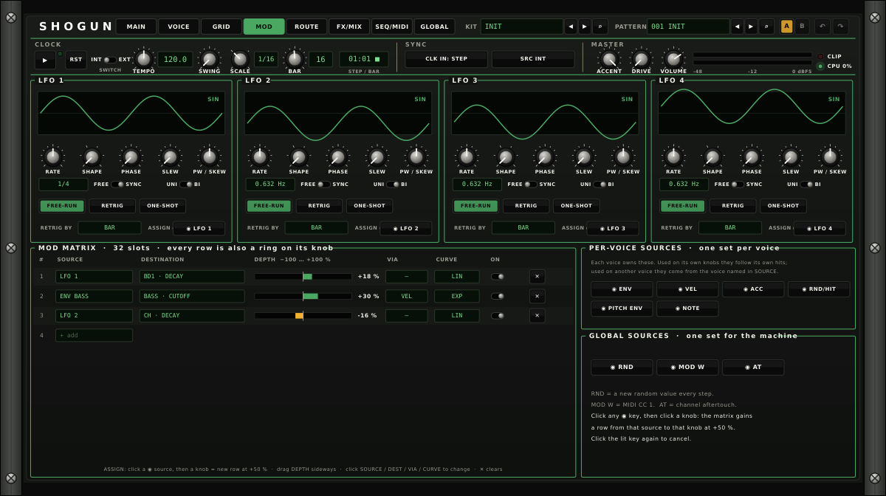

**LFO 1 to 4.** Each LFO shows its waveform.

| Control | Range | What it does |
|---|---|---|
| **RATE** | 0.01 to 40 Hz (FREE) or 8 BAR to 1/64T (SYNC) | Speed. The display shows Hz or the note value. |
| **SHAPE** | SIN, TRI, RAMP, SAW, SQR, S&H | Waveform. |
| **PHASE** | 0 to 360° | Start phase. |
| **SLEW** | 0 to 100 % | Smooths steps, for example on S&H. |
| **PW / SKEW** | 0 to 100 % | Pulse width or skew. |
| **FREE / SYNC** | | Free rate in Hz, or locked to the tempo. |
| **UNI / BI** | | Unipolar or bipolar output. |
| **FREE-RUN / RETRIG / ONE-SHOT** | | Runs freely, restarts on each RETRIG event, or runs once per event. |
| **RETRIG BY** | BAR, ANY TRIG, OWN VOICE, one voice's TRIG | What restarts the LFO. OWN VOICE gives every voice its own copy of the LFO, restarted by its own hits. |
| **ASSIGN** | | Arms this LFO as a source for one-click assignment (below). |

**MOD MATRIX.** 32 slots. Each row has a SOURCE, a DESTINATION (any continuous parameter), a DEPTH from -100 to +100 %, an optional VIA source that scales the depth, a CURVE (LIN, EXP, LOG, S-CRV) and an ON switch.

- Click SOURCE, DEST or VIA for a menu. Per-voice sources offer OWN VOICE or a named voice.
- Drag DEPTH sideways.
- Click CURVE to step through the curves, ON to switch the row, **×** to clear it.
- Click **+ add** (the SOURCE of the empty row) to start a new row. The panel lists the first ten rows in use.
- Every row also shows as a ring on its destination knob.

**PER-VOICE SOURCES** (each voice has its own): **ENV**, **VEL**, **ACC**, **RND/HIT** (a new random value per hit), **PITCH ENV**, **NOTE**. **GLOBAL SOURCES**: **RND** (a new random value every step), **MOD W** (MIDI CC 1) and **AT** (channel aftertouch).

**Assigning in one click.** Click a ◉ source key (or an LFO's ASSIGN key), then click any knob: the matrix gains a row from that source to that knob at +50 %. Click the lit key again to cancel.

### 3.8 ROUTE tab

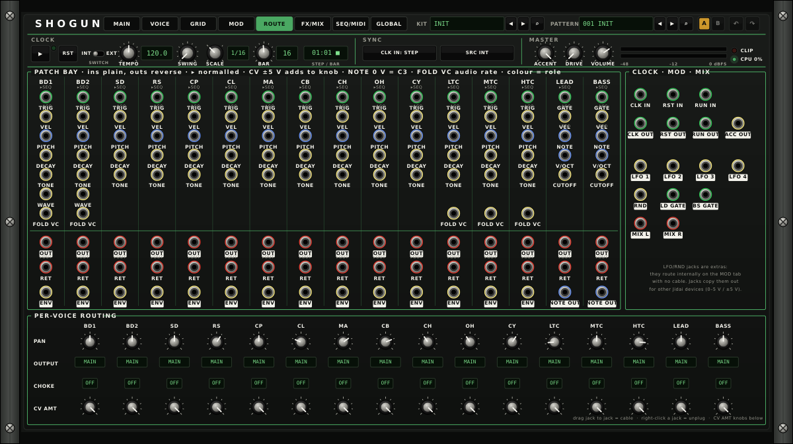

**PATCH BAY.** All of SHOGUN's jacks, one column per voice and a CLOCK · MOD · MIX block. Section 4 lists every jack.

- Drag from one jack to another to patch a cable.
- Right-click a jack to unplug its cables.
- Input labels are plain and output labels are reversed (light label). A **▸SEQ** mark shows that TRIG is normalled to the sequencer. Ring colours show the cable role.

**PER-VOICE ROUTING.** For every voice:

| Control | Range | What it does |
|---|---|---|
| **PAN** | -100 to +100 % | Equal-power pan. |
| **OUTPUT** | MAIN, BUS A to D, AUX 1/2 to AUX 15/16, PAIR | Where the voice goes (section 7 lists the PAIR outputs). |
| **CHOKE** | OFF, 1 to 4 | Choke group. |
| **CV AMT** | -100 to +100 % | Scales the voice's PITCH, DECAY and TONE jacks (drum voices). |

### 3.9 FX/MIX tab

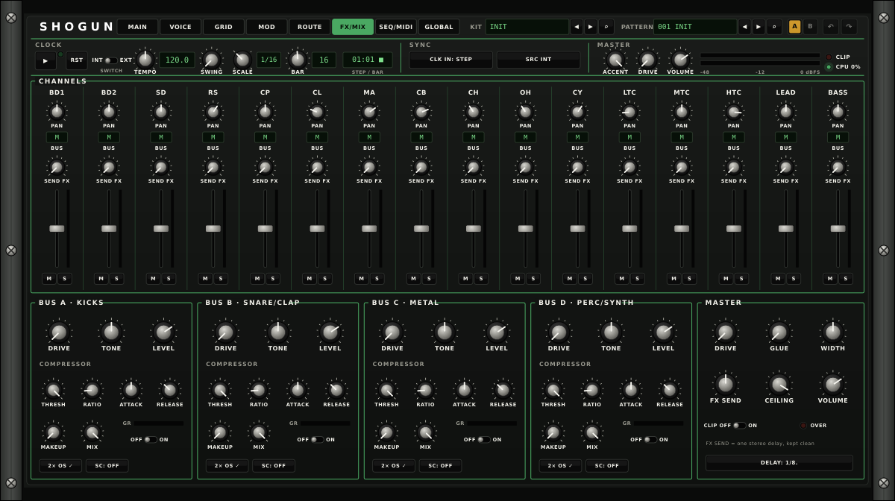

**CHANNELS.** One strip per voice: **PAN**, **BUS** (shows the voice's OUTPUT: M for MAIN, A to D, an aux pair or PR for PAIR), **SEND FX** (to the stereo delay), a level fader and **M**/**S** (mute, solo).

**BUS A to D** (labelled KICKS, SNARE/CLAP, METAL, PERC/SYNTH; any voice can use any bus):

| Control | Range | What it does |
|---|---|---|
| **DRIVE** | OFF to +24 dB | Bus saturation. |
| **TONE** | -100 to +100 % | Tilt EQ, darker to brighter. |
| **LEVEL** | -inf to +6 dB | Bus level into the master. |
| **THRESH** | -40 to 0 dB | Compressor threshold. |
| **RATIO** | 1:1 to 20:1 | Compressor ratio. |
| **ATTACK** | 0.1 to 100 ms | Compressor attack. |
| **RELEASE** | 10 to 1000 ms | Compressor release. |
| **MAKEUP** | 0 to +24 dB | Makeup gain. |
| **MIX** | 0 to 100 % | Parallel compression blend. |
| **OFF / ON**, **GR** | | Compressor on, and its gain reduction meter. |
| **SC** | OFF or any voice | Sidechain: the compressor listens to that voice. |
| **2× OS** | 1×, 2×, 4× | Shows the realtime oversampling. Click to change it (the same setting as on GLOBAL). |

**MASTER:**

| Control | Range | What it does |
|---|---|---|
| **DRIVE** | OFF to +24 dB | Master drive. |
| **GLUE** | 0 to 100 % | Gentle bus compressor. 0 is off. |
| **WIDTH** | 0 to 100 %, default 50 % | Stereo width. 0 is mono, 50 % unchanged, 100 % wider. Lows below 120 Hz are never widened. |
| **FX SEND** | 0 to 100 %, default 50 % | Return level of the delay. |
| **CEILING** | -6 to 0 dBFS, default -0.3 | Clipper ceiling. |
| **VOLUME** | -inf to +6 dB | Master volume. |
| **CLIP OFF / ON**, **OVER** | | Soft clipper on the output, and a light when the output goes over. |
| **DELAY** | 1/16 to 1/2T, default 1/8. | Delay time, synced to the tempo. |

### 3.10 SEQ/MIDI tab

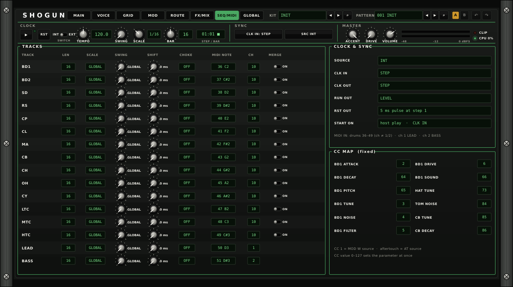

**TRACKS.** One row per track:

| Column | What it does |
|---|---|
| **LEN** | Track length, 1 to 32. |
| **SCALE** | GLOBAL (follows the header SCALE), 1/32, 1/16, 1/8T or 1/8. Click to step. |
| **SWING** | GLOBAL (knob fully left) or the track's own swing, 50 to 75 %. |
| **SHIFT** | Delays the whole track by 0 to 30 ms. |
| **CHOKE** | Choke group, as on ROUTE. |
| **MIDI NOTE**, **CH** | The track's MIDI note and channel (section 5). |
| **MERGE** | Drum tracks: with the INT/EXT switch on INT, lets the TRIG jack play the voice alongside the pattern. |

**CLOCK & SYNC.** SOURCE (HOST, INT, EXT), CLK IN (STEP or 1 to 48 PPQN), CLK OUT (STEP or 1 to 48 PPQN), RUN OUT (LEVEL or PULSE), RST OUT (5 ms pulse at step 1) and START ON (host play or CLK IN). Section 5 explains them.

**CC MAP (fixed).** The twelve controls on MIDI CCs (section 5).

### 3.11 GLOBAL tab

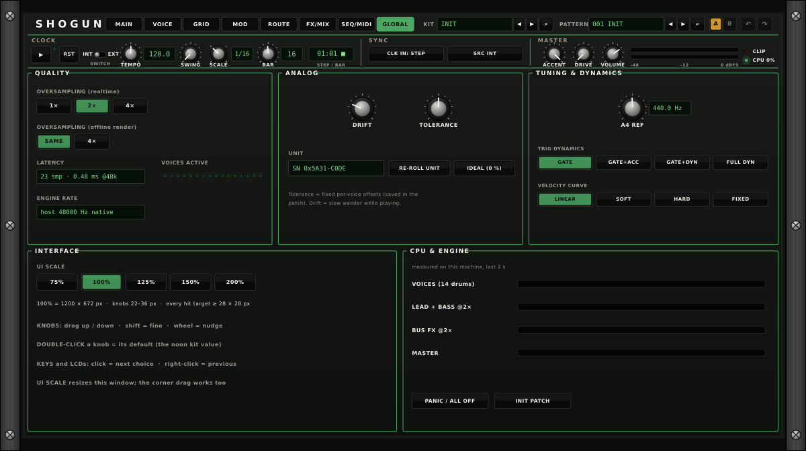

| Section | Control | What it does |
|---|---|---|
| QUALITY | **OVERSAMPLING (realtime)** 1×, 2×, 4× | Default 2×. Higher settings reduce aliasing in drive and folding and add latency (section 8). |
| QUALITY | **OVERSAMPLING (offline render)** SAME, 4× | SAME uses the realtime setting when you export. 4× always renders at 4×. |
| QUALITY | LATENCY, VOICES ACTIVE, ENGINE RATE | The current latency in samples and ms, a light per sounding voice, and the host sample rate. |
| ANALOG | **DRIFT** 0 to 100 %, default 25 % | Slow pitch wander while playing. |
| ANALOG | **TOLERANCE** 0 to 100 %, default 50 % | Fixed per-voice offsets of pitch, decay and filter, as between real components. |
| ANALOG | **UNIT**, **RE-ROLL UNIT** | The unit's serial number, which fixes the tolerance offsets. RE-ROLL UNIT picks a new unit. The unit is saved with the patch. |
| ANALOG | **IDEAL (0 %)** | Sets DRIFT and TOLERANCE to 0. |
| TUNING & DYNAMICS | **A4 REF** 415 to 466 Hz | Tuning reference. Default 440 Hz. |
| TUNING & DYNAMICS | **TRIG DYNAMICS** | How the voltage of a TRIG jack sets the level when VEL is unpatched: **GATE** every hit full, **GATE+ACC** 4.5 V or more is an accent, **GATE+DYN** 2.5 to 5 V sets the level, **FULL DYN** 1 to 5 V sets the level. |
| TUNING & DYNAMICS | **VELOCITY CURVE** | MIDI velocity response: LINEAR, SOFT, HARD or FIXED (every note at full velocity). |
| INTERFACE | **UI SCALE** 75 %, 100 %, 125 %, 150 %, 200 % | Resizes the window. You can also drag its corner. |
| CPU & ENGINE | Meters | Load of the drum voices, LEAD and BASS, bus effects and master. |
| CPU & ENGINE | **PANIC / ALL OFF** | Stops the sequencer and restarts the pattern. |
| CPU & ENGINE | **INIT PATCH** | Loads INIT: default kit, empty pattern, no cables, no matrix rows. |

## 4. Patching

### 4.1 The patch bay

SHOGUN's patch bay is on the ROUTE tab. You can cable any output to any input, including SHOGUN to itself (a cable between two SHOGUN jacks has one sample of delay). Several cables into one input add up. In the JIDAI RACK the same jacks sit on SHOGUN's rear plate and patch to the other devices (appendix).

All jacks follow the **Jidai Cable Standard**:

| Role | Colour | Level |
|---|---|---|
| Audio | Red | ±5 V is full scale |
| 1 V/oct pitch | Blue | 1 V per octave, 0 V = C3 |
| Gate / clock | Green | Outputs 0 V or +5 V. Inputs go high above 1.0 V and low below 0.5 V. |
| CV | Yellow | ±5 V (or 0 to 5 V for unipolar sources) |

The bay offers **151 jacks**. A patch keeps every cable when you save it, and patches made with older jack names still load with their cables in place.

### 4.2 Normals and how inputs combine

A normalled input has an internal connection that a cable replaces:

| Input | With no cable | With a cable |
|---|---|---|
| **TRIG** (drums), **GATE** (LEAD, BASS) | The pattern plays the voice (**▸SEQ**). | Rising edges play the voice when the INT/EXT switch is on EXT, or on INT with the track's MERGE on. On EXT the pattern no longer plays the voices. A synth note ends when its GATE falls. |
| **VEL** | Pattern hits use the step's accent level: 2.35 V (soft), 3.71 V (normal) or 5 V (accent). Jack hits use TRIG DYNAMICS. | The cable sets the velocity of every hit: 0 V quietest, 5 V full. |
| **NOTE** (LEAD, BASS) | The step's note. | The cable sets the note (1 V/oct, 0 V = C3) and moves a held note at once. |
| **RET** | The voice's own sound. | The cable replaces the voice's sound in its mixer channel. Pan, OUTPUT, SEND FX, mute and solo still apply. |
| **FOLD VC** (BD1, BD2, toms) | The WAVE section's VC SOURCE. | The cable is the VC source, at audio rate. ±5 V is full depth. |

Modulation inputs add to their knob:

| Input | Scaling |
|---|---|
| **PITCH** (drums) | 1 V/oct on the voice's pitch, times CV AMT. |
| **DECAY**, **TONE** (drums) | ±5 V sweeps the knob's whole range, times CV AMT. |
| **WAVE** (BD1, BD2) | ±5 V sweeps the WAVE knob's whole range. |
| **V/OCT** (LEAD, BASS) | 1 V/oct transposes the synth. |
| **CUTOFF** (LEAD, BASS) | 1 V/oct on the filter cutoff. |

A voice's **OUT** jack carries a copy of the voice after its level and envelope, before pan. The voice stays in the mix, so to use an external effect as an insert, patch OUT to the effect and the effect back into the same voice's RET.

### 4.3 Jack table

Each drum voice (BD1, BD2, SD, RS, CP, CL, MA, CB, CH, OH, CY, LTC, MTC, HTC) has eight jacks:

| Jack | Dir | Role | Signal |
|---|---|---|---|
| TRIG | in | Gate | A rising edge plays the voice. |
| VEL | in | CV | Velocity, 0 to 5 V. |
| PITCH | in | 1 V/oct | Adds to the voice's pitch. |
| DECAY | in | CV | Adds to DECAY (±5 V). |
| TONE | in | CV | Adds to the voice's tone control (±5 V). |
| RET | in | Audio | Return into the voice's mixer channel. |
| OUT | out | Audio | The voice, post level and envelope, pre pan. |
| ENV | out | CV | The voice's envelope, 0 to 5 V, scaled by the hit's velocity. |

BD1 and BD2 add **WAVE** (CV in). BD1, BD2, LTC, MTC and HTC add **FOLD VC** (CV in, audio rate).

LEAD and BASS each have eight jacks:

| Jack | Dir | Role | Signal |
|---|---|---|---|
| GATE | in | Gate | Starts a note on the rising edge and ends it on the falling edge. |
| VEL | in | CV | Velocity, 0 to 5 V. 4.5 V or more is an accent. |
| NOTE | in | 1 V/oct | The note, 0 V = C3. |
| V/OCT | in | 1 V/oct | Transposes the synth. |
| CUTOFF | in | CV | Adds to the cutoff, 1 V/oct. |
| RET | in | Audio | Return into the voice's mixer channel. |
| OUT | out | Audio | The voice, post level and envelope, pre pan. |
| NOTE OUT | out | 1 V/oct | The note playing, including glide. |

Clock, modulation and mix jacks:

| Jack | Dir | Role | Signal |
|---|---|---|---|
| CLK IN | in | Gate | Clock pulses for SRC EXT (STEP or 1 to 48 PPQN, set by CLK IN). |
| RST IN | in | Gate | A rising edge restarts the pattern from step 1. |
| RUN IN | in | Gate | A rising edge starts or stops the sequencer. |
| CLK OUT | out | Gate | 0/5 V square clock while running, at the step rate or 1 to 48 PPQN (set by CLK OUT). |
| RST OUT | out | Gate | 5 ms, 5 V pulse at step 1 of every bar. |
| RUN OUT | out | Gate | LEVEL: 5 V while running. PULSE: a 5 ms pulse at start. |
| ACC OUT | out | CV | The accent level of the current step's drum hits (2.35, 3.71 or 5 V), 0 V on steps without a hit. Also active when the INT/EXT switch is on EXT. |
| LFO 1 to LFO 4 | out | CV | The LFOs: 0 to 5 V (UNI) or ±5 V (BI). |
| RND | out | CV | A new random value from 0 to 5 V on every step. |
| LD GATE, BS GATE | out | Gate | 5 V while LEAD or BASS holds a note. |
| MIX L, MIX R | out | Audio | SHOGUN's main stereo mix. |

The LFO and RND jacks copy sources that already work inside SHOGUN through the MOD tab without a cable. Use them to modulate other Jidai devices.

That is 112 drum jacks, 16 synth jacks and 23 clock, modulation and mix jacks: 151 in all.

### 4.4 Patch ideas

- **LFO 1 → BD1 PITCH**: a kick whose pitch moves with the LFO. Turn down BD1's CV AMT for a subtler move.
- **LEAD NOTE OUT → BASS NOTE**: BASS follows LEAD's notes. Program BASS steps where you want it to play.
- **CH ENV → BASS CUTOFF**: the hats open the bass filter on every hit.
- **CLK OUT → another device's clock**: drive BUSHIDO or any clock input from SHOGUN's tempo.
- **BD1 OUT → effect → BD1 RET**: an external effect inserted on the kick.

## 5. MIDI and host sync

### 5.1 Clock sources

The **SRC** key (header) and SOURCE (SEQ/MIDI) pick the clock:

| SRC | Behaviour |
|---|---|
| **HOST** | Plays while the DAW plays, at the host tempo, locked to the song position. Loops and jumps land on the right step. ▶ is not needed. |
| **INT** | Runs on TEMPO. Start and stop with ▶ or a pulse at RUN IN. |
| **EXT** | Steps on rising edges at CLK IN: one step per pulse with CLK IN on STEP, or 1 to 48 pulses per quarter note. Start it with ▶ or a pulse at RUN IN. RST IN restarts the pattern. |

With SRC on HOST and no host transport (for example in a host that sends no play position), SHOGUN runs on its own TEMPO with ▶.

CLK OUT, RST OUT and RUN OUT follow whichever source is active, so SHOGUN can clock other devices in every mode.

### 5.2 Playing from the pattern or from jacks

The **INT/EXT** switch in the CLOCK strip sets what plays the voices. On **INT** the pattern plays them, and TRIG and GATE jacks are ignored unless that track's MERGE is on. On **EXT** only the TRIG and GATE jacks play them. The clock keeps running in both, so ACC OUT, the LFOs and the clock outputs carry on.

### 5.3 MIDI notes

| Input | Plays |
|---|---|
| Notes 36 to 49 on any channel except 1 and 2 | The drums: 36 BD1, 37 BD2, 38 SD, 39 RS, 40 CP, 41 CL, 42 MA, 43 CB, 44 CH, 45 OH, 46 CY, 47 LTC, 48 MTC, 49 HTC. |
| Notes 50 and 51 on those channels | LEAD and BASS at C3. |
| Any note on channel 1 | LEAD at that note. MIDI note 48 is C3 (0 V). |
| Any note on channel 2 | BASS at that note. |

MIDI notes play the voices in both INT and EXT, and alongside the pattern. Velocity sets the level through the VELOCITY CURVE (GLOBAL).

### 5.4 MIDI CCs

Twelve voice controls have fixed CCs. A CC value from 0 to 127 sets the control at once over its whole range.

| Control | CC | Control | CC |
|---|---|---|---|
| BD1 ATTACK | 2 | BD1 DRIVE | 6 |
| BD1 TUNE | 3 | BD1 DECAY | 64 |
| BD1 NOISE | 4 | BD1 PITCH | 65 |
| BD1 FILTER | 5 | BD1 SOUND | 66 |
| HAT TUNE | 73 | CB TUNE | 85 |
| TOM NOISE | 84 | CB DECAY | 86 |

CC 1 (mod wheel) is the **MOD W** source and channel aftertouch is the **AT** source in the mod matrix.

## 6. Factory presets by bank

SHOGUN has one factory bank: INIT and 21 kits. Each kit loads with its own pattern, tempo and mod rows. Every kit is trimmed to peak at about -8 dBFS with the default master settings. With SRC on HOST, the DAW's tempo replaces the kit's tempo.

| No. | Name | BPM | What it plays |
|---|---|---|---|
| 001 | INIT | 120 | The default kit with an empty pattern. |
| 002 | Deep Round Kick House | 122 | Long round kick, clap on two and four, off-beat open hats and a bass line with dotted-eighth delay, light swing. |
| 003 | Peak Time Warehouse | 132 | Driven kick, BD2 rumble and hats on a compressed bus keyed by the kick, glue and master drive. |
| 004 | Metallic Industrial | 128 | Folded kick, noisy folded toms through a driven bus, cowbell, cymbal and a ratcheted snare. |
| 005 | Electro Body Pop | 126 | Long kick, square-wave LEAD arpeggio and BASS, cowbell and claves. |
| 006 | Dusty Broken Beat | 98 | Swung broken beat with probability and micro-timing on snare and hats, high drift and tolerance. |
| 007 | Head Nod Boom Bap | 90 | Heavy swing, a laid-back snare and a long, low bass. |
| 008 | Minimal Click Groove | 124 | Short clicky kick, rim and claves with per-step tuning locks, and LFO 3 on the maraca decay. |
| 009 | Conga Groove | 112 | Toms switched to congas, claves, cowbell and maracas, with flams. |
| 010 | Half Time Pressure | 140 | Half-time snare, long BD2, a gliding bass and a hat ratchet roll. |
| 011 | Slow Ballad Brushes | 72 | 12-step bar on 1/8T: soft kick and snare, a LEAD melody and a cymbal pattern with probability. |
| 012 | Seven Eight Stepper | 118 | 14-step bar (7/8) with a square-wave bass. |
| 013 | Polymeter Drift | 126 | Tracks of 12, 10, 7, 5 and 9 steps against a four-on-the-floor kick, with four LFO rows. |
| 014 | Acid Line Workout | 130 | Resonant saw BASS with accents, slides and cutoff locks, swept by LFO 2. |
| 015 | Breakbeat Rush | 136 | Syncopated kick, ghost snares with a flam and a cymbal on the downbeat. |
| 016 | Two Step Shuffle | 132 | Strong swing, a skipping kick and a gliding bass. |
| 017 | Lead Arp Sequence | 120 | Sixteen-note saw LEAD arpeggio with octave locks, LFOs on cutoff and pan. |
| 018 | Dub Echo Chamber | 118 | Rim, clap and LEAD into a long dotted-eighth delay over a deep bass. |
| 019 | Rolling Hat Half Step | 70 | Hat ratchets up to 8, a long BD2 with pitch bends. |
| 020 | Shaker Percussion Circle | 116 | Maracas with micro-timing, cowbell, claves and toms. |
| 021 | Jungle Break Roller | 170 | Fast break with snare ratchets and a long gliding sub bass. |
| 022 | Lo-Fi Tape Wobble | 84 | LFOs wobble the LEAD and BASS tuning, with high drift and tolerance. |

## 7. DAW setup

SHOGUN is a VST3 instrument with MIDI input, a stereo main output and eight optional stereo aux outputs.

### Installing

Copy `SHOGUN.vst3` into your system's VST3 folder:

| System | VST3 folder |
|---|---|
| macOS | `~/Library/Audio/Plug-Ins/VST3/` (just you) or `/Library/Audio/Plug-Ins/VST3/` (all users) |
| Windows | `C:\Program Files\Common Files\VST3\` |
| Linux | `~/.vst3/` |

Then have your DAW rescan its plugins. SHOGUN is listed under **Martial Systems**.

### Using it in any DAW

1. Insert SHOGUN on an instrument track.
2. Set **SRC** to **HOST** so SHOGUN plays with your DAW's transport. Set it again after loading a kit.
3. To play voices from MIDI, record or draw notes on the track (section 5).
4. Pick kits from your DAW's program list or from SHOGUN's KIT display. The DAW saves the whole patch with your project: kit, pattern, cables, matrix rows and unit.
5. Leave the DAW's plugin delay compensation on. SHOGUN reports its latency (0, 23 or 26 samples).

### Multiple outputs

Enable SHOGUN's aux outputs in your DAW to give voices their own mixer channels. A voice's OUTPUT setting (ROUTE tab) sends it to **AUX 1/2** (the plugin's Aux 1 output) through **AUX 15/16** (Aux 8). **PAIR** sends each voice to a fixed place:

| Aux output | Left | Right |
|---|---|---|
| Aux 1 | BD1 | BD2 |
| Aux 2 | SD | RS |
| Aux 3 | CH, OH | CY |
| Aux 4 | CP (stereo) | |
| Aux 5 | LTC, MTC, HTC (stereo) | |
| Aux 6 | CL | CB |
| Aux 7 | MA (stereo) | |
| Aux 8 | LEAD | BASS |

A voice routed to an aux output leaves the main mix. Its SEND FX still feeds the delay on the main mix.

### Example: FL Studio

1. Close FL Studio, copy the VST3 into your VST3 folder, and open FL Studio.
2. Open **Options › Manage plugins** and click **Find installed plugins**.
3. Add SHOGUN to the Channel Rack and route it to a Mixer insert.
4. Set SRC to HOST and press play. SHOGUN follows the song position.
5. For multiple outputs, set the voices' OUTPUT to aux outputs, then route SHOGUN's outputs to Mixer inserts in the plugin wrapper's settings.
6. FL Studio's plugin delay compensation uses the latency SHOGUN reports.

## 8. Specs

| | |
|---|---|
| Type | Drum machine: 14 drum voices and 2 synth voices, with a sequencer track per voice |
| Format | VST3 instrument. Also a device in the JIDAI RACK. |
| Outputs | Stereo main plus 8 optional stereo aux outputs |
| MIDI | Note input (drums on notes 36 to 49, LEAD channel 1, BASS channel 2), 12 fixed CCs, mod wheel, channel aftertouch |
| Sample rates | Runs at the host's sample rate. Tested at 44.1, 48 and 96 kHz. |
| Oversampling | 1×, 2× (default) or 4× realtime. Offline render at the same setting or 4×. |
| Latency | 0 samples at 1×, 23 at 2×, 26 at 4×, reported to the host (23 samples is 0.48 ms at 48 kHz) |
| Sequencer | 16 tracks, 1 to 32 steps each, per-track scale, swing and shift, parameter locks |
| Modulation | 4 LFOs, 32-slot matrix, per-voice and global sources |
| Mixer | 4 buses with drive, tone and compressor, stereo delay send, master drive, glue, width and clipper |
| Patch bay | 151 jacks under the Jidai Cable Standard |
| Parameters | 454, all automatable |
| Factory programs | 22 (INIT and 21 kits with patterns) |
| Undo | 64 levels, plus A/B compare |
| UI | 1200 × 672, 50 % to 200 % (keys for 75 % to 200 %) |
| Rack device | 5.8 U open, 1 U closed, 4 U back. 0, 23 or 26 samples latency, compensated by the rack. |

## 9. Troubleshooting

| Problem | What to check |
|---|---|
| SHOGUN doesn't play with my DAW | Set SRC to HOST. Loading a kit sets SRC back to INT. |
| Nothing plays on INT | Click ▶. Check that the INT/EXT switch is on INT. |
| Nothing plays on EXT | Click ▶ (or send a pulse to RUN IN), then send pulses to CLK IN. Check the CLK IN setting (STEP or PPQN). |
| The pattern runs but voices are silent | Check the INT/EXT switch: on EXT only TRIG and GATE jacks play the voices. Also check mute, solo and LEVEL. |
| A TRIG cable does nothing | On INT, turn on the track's MERGE (SEQ/MIDI), or switch to EXT. |
| A voice is missing from the main mix | Its OUTPUT is set to an aux output. Enable that output in your DAW, or set OUTPUT to MAIN. |
| A voice is silent with a cable in RET | RET replaces the voice's sound. Check the signal you return, or remove the RET cable. |
| Every hit plays at the same level | Check MASTER ACCENT and VEL → LEVEL, and VELOCITY CURVE (FIXED plays all notes at full velocity). |
| The drums are late against other tracks | Turn on plugin delay compensation in your DAW, or set OVERSAMPLING to 1×. |
| Clipping (CLIP lit) | Lower VOLUME or the voice levels, or turn on the CLIP soft clipper. Click CLIP to clear it. |
| Kit sounds slightly different each time on another computer | The unit (GLOBAL) sets the tolerances. It is saved with the patch. Click IDEAL for no tolerance or drift. |
| Plugin not listed | Check the VST3 folder (section 7) and rescan in your DAW. |

## 10. Legal

Copyright © 2026 Martial Systems LLC. All rights reserved.

SHOGUN, JIDAI RACK, BUSHIDO, RONIN, ORIGAMI and the Jidai Collection are products of Martial Systems LLC. All other trademarks belong to their owners. See the LICENSE file that comes with SHOGUN for the full terms.

---

## Appendix: Back panel patching (SHOGUN in the JIDAI RACK)

In the JIDAI RACK, SHOGUN is a 5.8 U device when open and a 1 U strip when closed. Press **Tab** (or click **BACK** in the rack header) to flip the whole rack around. On the back, SHOGUN is a 4 U rear plate with a box for every voice and for CLOCK, MOD and MIX.

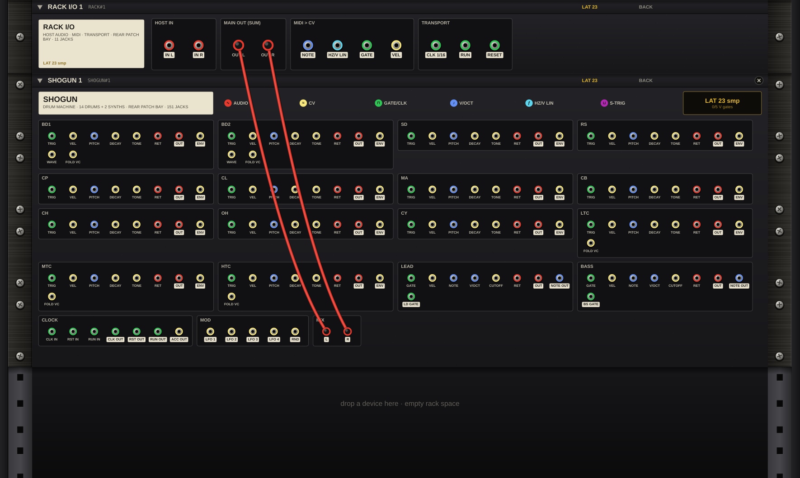

### Rear jacks

The rear plate carries the same jacks as the ROUTE tab (section 4.3) in the same colours. It also shows two reserved jacks, **CLOCK › FILL IN** and **MOD › LANE A**, which carry no signal. That is why the plate's sticker counts 153 jacks against the 151 on the ROUTE tab.

Output jacks have a light label and inputs a plain one. The **LAT** plate shows SHOGUN's latency: 0, 23 or 26 samples at 1×, 2× or 4×.

### Automatic cables

When you add a SHOGUN, the rack patches **MIX L/R** to **RACK I/O › MAIN OUT L/R**, and SHOGUN follows the host transport (SRC HOST). Press **K** to cycle the cable views: **ALL**, **HIDE PASS-THRU**, **SELECTED** and **HIDE**.

### Patching other voices with SHOGUN

A SHOGUN **RET** jack feeds audio into SHOGUN's mix through its oversampled output stage, so at 2× or 4× a signal patched into RET reaches SHOGUN's MIX twice SHOGUN's delay later (46 or 52 samples), while SHOGUN's own voices arrive after the single delay (23 or 26). To keep an external voice tight with the drums, patch it to **MAIN OUT** next to SHOGUN's MIX, not into SHOGUN's RET, and let the rack line them up. The rack delays the faster paths into MAIN OUT to match the slowest and shows an amber **+n comp** tag on the delayed cables.

Use SHOGUN's RET jacks for effects you insert on a SHOGUN voice (OUT to the effect, the effect back into RET).

### Worked example: Acid Drum Jam (starter rack)

Open the rack's **RACKS** menu and choose **EDM › Acid Drum Jam**, then press Tab.

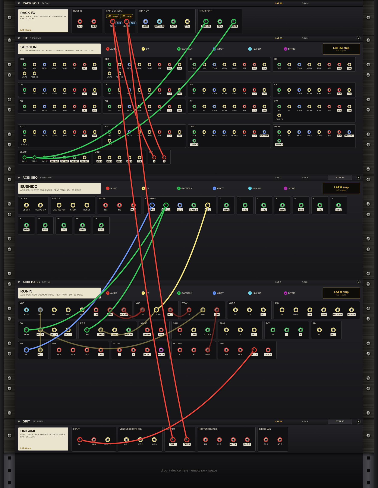

| From | To | Why |
|---|---|---|
| RACK I/O › CLK 1/16 | SHOGUN › CLOCK CLK IN | SHOGUN steps on every sixteenth note from the DAW. |
| RACK I/O › RESET | SHOGUN › CLOCK RST IN | Restarts SHOGUN's pattern when the DAW starts. |
| BUSHIDO › CV A, GATE A, CV C | RONIN | The acid line on RONIN. |
| RONIN › HOST OUT L | ORIGAMI › IN L | The bass through the folder. |
| ORIGAMI › OUT L/R | RACK I/O › MAIN OUT L/R | The folded bass to the DAW. |
| SHOGUN › MIX L/R | RACK I/O › MAIN OUT L/R | The drums to the DAW. |

ORIGAMI at 2× delays the bass by 46 samples and SHOGUN at 2× delays the drums by 23, so the rack delays the drums by another 23 (the **+23 comp** tags on the SHOGUN cables). The bass reaches MAIN OUT next to SHOGUN's MIX, never through RET, so drums and bass arrive together.

### Worked example: Full EDM Jam (starter rack)

**RACKS ▾ › EDM › Full EDM Jam** clocks SHOGUN from the host with no clock cables. SHOGUN's MIX L/R run through ORIGAMI to MAIN OUT, and BUSHIDO's bass on RONIN goes straight to MAIN OUT. SHOGUN at 2× delays the drums by 23 samples, so the rack delays the bass by 23 to match (LAT 23).

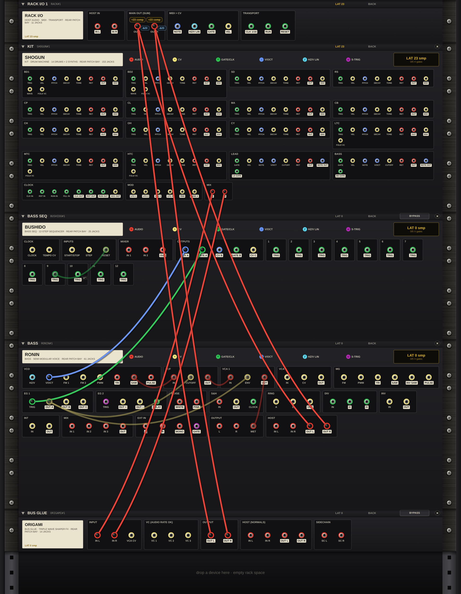

Try patching **SHOGUN › CLK OUT** into BUSHIDO's clock input with SHOGUN on SRC INT, so the drums set the tempo, or **SHOGUN › LFO 1** into an ORIGAMI VC input for a fold that moves with the groove.
